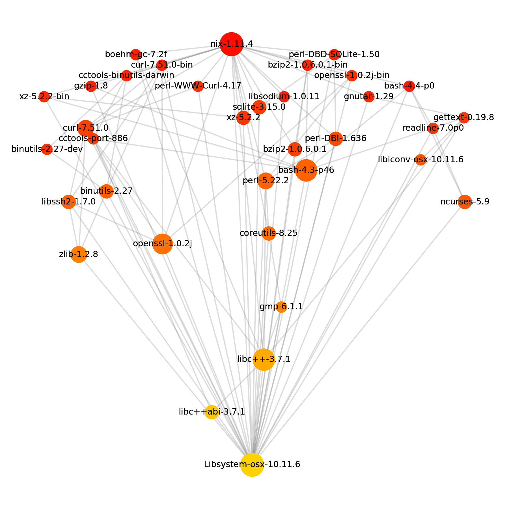
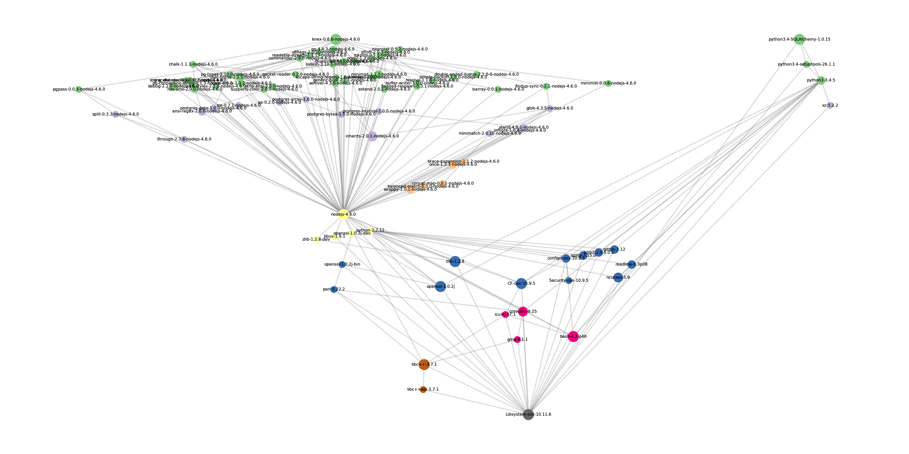
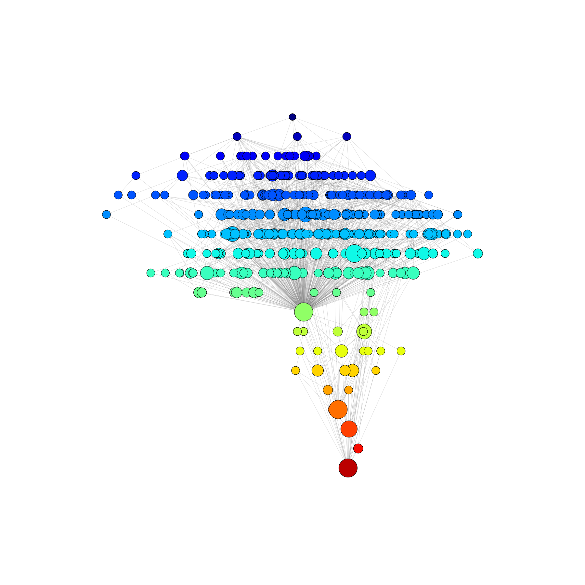
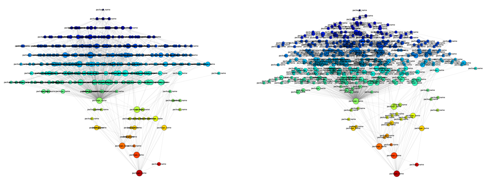
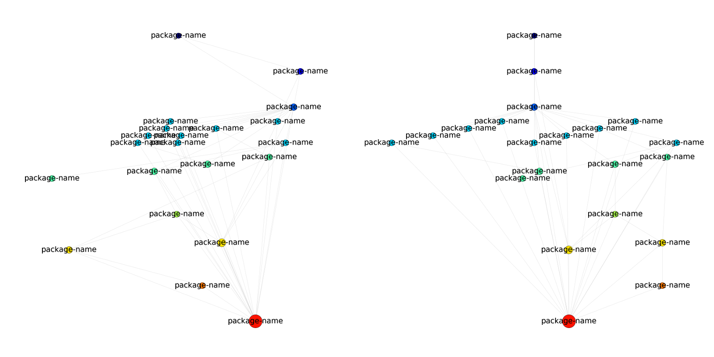

# Nix Dependency Visualizer

Script that automates the generation of pretty dependency graphs from the output of ``nix-store -q --graph <package>``.

## Example Images

The above graphs show the dependency tree for Nix (top-left), for both [SQLAlchemy](http://www.sqlalchemy.org/) and [knex](http://knexjs.org/) (top-right image), and for Git (bottom).  The Nix dependency tree was generated with the following command

    nix-visualize /nix/store/<hash>-nix-1.11.4 -c config.cfg -s nix -o nix.png

the database image was generated with

    nix-visualize /nix/store/<hash>-python3.4-SQLAlchemy-1.0.15 /nix/store/<hash>-knex-0.8.6-nodejs-4.6.0 -c config.cfg -s dbs -o dbs.png

and the git image was generated with

    nix-visualize /nix/store/<hash>-git-2.10.1 -c config.cfg -s git -o git.png

The configuration parameters to generate all of these images are provided in [config.cfg](config.cfg)

## Installation

### Nix Installation (preferred)

The file [default.nix](default.nix) in the root of this directory contains the definition for `nix-visualize`.

So, for example, you could [download the zip file of this repo](https://github.com/craigmbooth/nix-visualize/archive/master.zip) and then unpack it, cd into it and run `nix-build ./default.nix`, after which `./result/bin/nix-visualize` is available.

### Non-Nix Installation

Install the prerequisites for the package.  On Linux based distributions:

   * `graphviz`
   * `graphviz-devel` (on CentOS, or `graphviz-dev` on Debian based distros)
   * `gcc`
   * `python-devel` (on CentOS, or `python-dev` on Debian based distros)
   * `tkinter` and `tk-devel`

You can then either download this repo and issue the command

    python setup.py install

Or, the package is available [on PyPI](https://pypi.python.org/pypi/nix_visualize/) under the name `nix-visualize`, so it can be pip installed

    pip install nix-visualize

## Command Line Options

After installation, the minimal way to run the CLI is

    nix-visualize <path-to-nix-store-object>

which will generate a graph of the dependency tree for the nix store object using sensible defaults for both appearance and graph layout.  In order to override settings, use a configuration file in .ini format.

    usage: visualize_tree.py [-h] [--configfile CONFIGFILE]
                             [--configsection CONFIGSECTION] [--output OUTPUT]
                             [--verbose] [--no-verbose]
                             packages [packages ...]

The command line options have the following meanings:

   * `packages`: Add any number of positional arguments, specifying full paths to nix store objects.  This packages will be graphed.
   * `--configfile`, or `-c`:  A configuration file in .ini format
   * `--configsection`, or `-s`: If the configuration file contains more than one section, you must specify this option
   * `--output`, or `-o`: The name of the png file to output (defaults to nix-tree.png)
   * `--verbose`: If this flag is present then print extra information to stdout.

## Configuration Files

If there is only a single section in the configuration file, it is only necessary to specify the ``--configfile`` option.  If the config file contains more than one section it is also necessary to specify ``--configsection``.

There

### List of parameters

   * `aspect_ratio [default 2.0]`: Ratio of x size of image to y size
   * `dpi [default 300]`: pixels per inch
   * `img_y_height_inches [default 24]`: size of the output image y dimension in inches
   * `font_scale [default 1.0]`: fonts are printed at size 12*font_scale
   * `color_scatter [default 1.0]`: The amount of randomness in the colors.  If this is zero, all nodes on the same level are the same color.
   * `edge_color [default #888888]`: Hex code for color of lines linking nodes
   * `font_color [default #888888]`: Hex code for color of font labeling nodes
   * `edge_alpha [default 0.3]`: Opacity of edges. 1.0 is fully opaque, 0.0 is transparent
   * `edge_width_scale [default 1.0]`:  Factor by which to scale the width of the edges
   * `show_labels [default 1]`: If this is 0 then hide labels
   * `y_sublevels [default 5]`: Number of discrete y-levels to use, see section on vertical positioning
   * `y_sublevel_spacing [default 0.2]`: Spacing between sublevels in units of the inter-level spacing.  Typically you should avoid having y_sublevels\*y_sublevel_spacing be greater than 1
   * `color_map [default rainbow]`: The name of a [matplotlib colormap](http://matplotlib.org/examples/color/colormaps_reference.html) to use
   * `num_iterations [default 100]`: Number of iterations to use in the horizontal position solver
   * `max_displacement [default 2.5]`: The maximum distance a node can be moved in a single timestep
   * `repulsive_force_normalization [default 2.0]`: Multiplicative factor for forces from nodes on the same level pushing each other apart.  If your graph looks too bunched up, increase this number
   * `attractive_force_normalization [default 1.0]`: Multiplicative factor for forces from nodes on the above level attracting their children.  If your graph is too spread out, try increasing this number
   * `min_node_size [default 100.0]`: Minimum size of a node (node size denotes how many packages depend on it)
   * `add_size_per_out_link [default 200]`: For each package that depends on a given node, add this much size
   * `max_node_size_over_min_node_size [default 5.0]`: The maximum node size, in units of the minimum node size
   * `tmax [default 30.0]`: Amount of time to integrate for.  If your graph has not had time to settle down, increase this.

## Graph Layout Algorithm

Packages are sorted vertically such that all packages are above everything that they depend upon, and horizontally so that they are close to their direct requirements, while not overlapping more than is necessary.

### Vertical Positioning

 Since dependency trees are acyclic, it is possible to sort the tree so that *every package appears below everything it depends on*.  The first step of the graph layout is to perform this sort, which I refer to in the code as adding "levels" to packages.  The bottom of the tree, level *n*, consists of any packages that can be built without any external dependencies.  The level above that, level *n-1* contains any packages that can be built using only packages on level *n*.  The level above that, *n-2*, contains any packages that can be built using only packages on levels *n-1* and *n*.  In this way, all packages on the tree sit above any of their dependencies, and the package we're diagramming out sits at the top of the tree.

#### Adding vertical offsets

In order to keep labels legible, after putting the packages on levels, some of them are given a small vertical offset.  This is done by sorting each level by x-position, and then ``cycling`` through sublevels and offsetting each node by an amount equal to ``y_sublevel_spacing``

### Horizontal Positioning

Initially the horizontal positions for packages are chosen randomly, but the structure of the underlying graph is made clearer if we try to optimize for two things:

1. A package should be vertically aligned with the things it depends upon (i.e. the nodes on the level above it that it is linked to), in order to minimize edge crossing as far as possible
2. A package should try not to be too close to another package on the same level, so as not to have nodes overlap.

## Credits

This software was written at 37,000 feet.  Thank you to American Airlines for putting me on a janky old plane for a 9 hour flight with no television.
